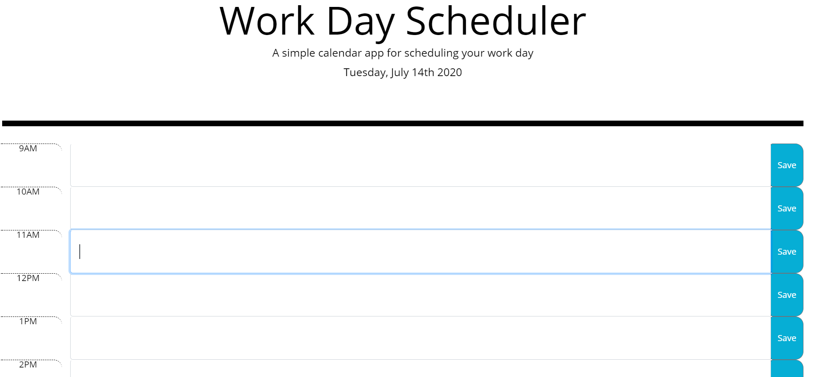

# Day-Planner
## About
For this assigment we needed to utlize javascript to create a daily planner that would log an indivuals hourly schedule. While logging the plans for the remainder of a day before reseting the following morning.

## Work Still Needed
I did not have enough time this week to fully understand concepts and needed skills to complete project. This will be resubmitted soon with a finished product. localStorage still needs to be done, along with the changing of colors to the divs based on hour of the day. Additionally I find that the Js that is presented and working, is not dry enough, and i suspect there is a better and more efficent way.

## Notes needed
EVERY note welcomed!!
When i try and style anything on my css sheet regarding the container it throws the whole page out of loop. the only time-slot that stays the way it should is the first one, everything after that is wacky. If you see why, please inform me in the comments. Thank you.

# Links

## Github Repository

[Repo Here](https://github.com/Nickcostanza/day-planner)

## URL to Active Page

[Planner Here](https://nickcostanza.github.io/day-planner/.)

